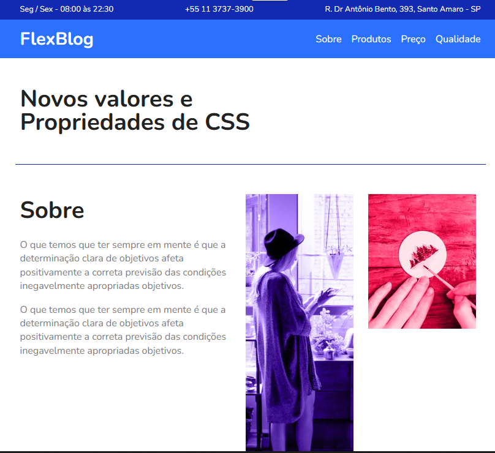

# FlexBlog 📂

- Site utilizado para estudar Flexbox

_Flexbox_ é uma tecnologia de layout de elementos em HTML e CSS que permite a criação de layouts flexíveis e responsivos. Com Flexbox, você pode criar layouts que se adaptam automaticamente às diferentes 

📌Projeto FlexBlog desenvolvido por SEU NOME 

- HTML e CSS ✅.
- Flexbox ✅.
- Responsividade com FlexBox ✅. 

## 📋 Considerações Finais
Projeto Finalizado ✅.
